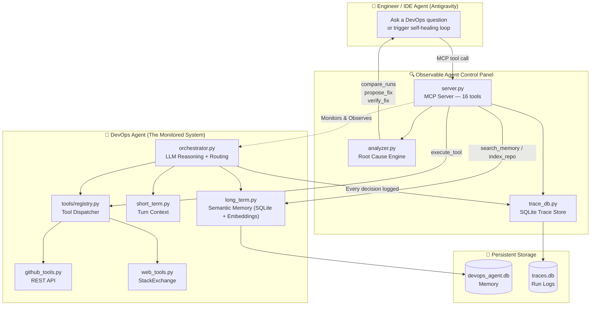
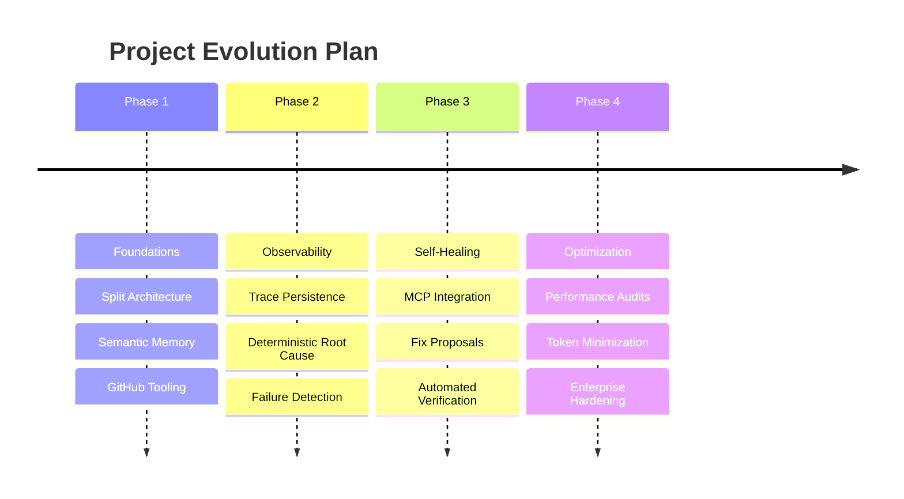
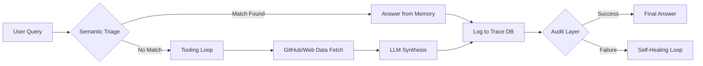

# Observable Agent Control Panel

<div align="center">


<br/>

### 📽️ [View the Demo](demo/octaclaw_demo.mp4)

*(Click above to play the demo video)*

</div>

> **The DevOps agent is the thing being monitored. The Observable Agent Control Panel is the monitoring system. Every decision the agent makes — which tool it called, why it routed that way, whether it got the right answer — is logged, analyzed, and diagnosed. When it fails, you don't guess why. The panel tells you exactly what broke, why it broke, and what to fix.**

---

## Project Structure

This repository contains **two distinct components** that work together:

```
observable-agent-control-panel/
├── devops_agent/               ← The agent being monitored
│   ├── core/
│   │   ├── orchestrator.py     # LLM reasoning + tool routing
│   │   └── llm_client.py       # Groq/OpenAI client
│   ├── memory/
│   │   ├── long_term.py        # SQLite + semantic embeddings
│   │   └── short_term.py       # In-session turn context
│   ├── tools/
│   │   ├── registry.py         # Pluggable tool dispatcher
│   │   ├── github_tools.py     # GitHub REST API tools
│   │   └── web_tools.py        # StackExchange search
│   ├── cli.py                  # Interactive terminal interface
│   └── main.py                 # Entry point
│
├── observable_agent_panel/     ← The monitoring system
│   ├── core/
│   │   ├── analyzer.py         # Failure analysis + root cause engine
│   │   ├── trace_db.py         # SQLite trace persistence
│   │   └── observability.py    # Metrics + alerting
│   └── server.py               # MCP server (16 tools for IDE agents)
│
├── tests/                      # 73 tests, all passing
├── docs/                       # Integration docs + agent prompt
└── data/                       # Persistent SQLite databases
```

---

## 📚 Documentation

Detailed guides and architecture deep-dives are available in the `docs/` directory:

| Document | Description |
|---|---|
| [**Quick Start**](docs/quickstart.md) | Get the system running in under 5 minutes. |
| [**Workflow Guide**](docs/workflow.md) | End-to-end operational workflow and logic. |
| [**IDE Integration**](docs/ide_integration.md) | Connect to Antigravity, Cursor, or Cline via MCP. |
| [**Agent Prompt**](docs/agent_prompt.md) | The system prompt to turn any IDE agent into a reliability engineer. |
| [**DevOps Agent Architecture**](docs/devops_agent_architecture.md) | Deep dive into the orchestrator, memory, and tool registry. |
| [**Control Panel Architecture**](docs/observable_agent_panel_architecture.md) | Deep dive into the monitoring, analysis, and self-healing engine. |

---

## How the Two Components Relate



---

## 🔭 Observability Layer (What Gets Logged)

Every DevOps agent run produces a complete trace record:

| Field | What It Captures |
|---|---|
| `run_id` | Unique UUID for the run |
| `query` | The exact question asked |
| `similarity_score` | How well memory matched (0–1) |
| `routing_decision` | `memory_only` / `tools_only` / `hybrid` |
| `hops` | Every tool called: name, status, latency |
| `hop_limit_hit` | Whether the agent ran out of attempts |
| `outcome` | Human rating: `y` / `n` / unrated |
| `memory_facts_used` | Which memory entries grounded the answer |

---

## 🔄 Self-Healing Agent Loop

When Antigravity connects via MCP, it follows a 6-step automated loop:

```
Observe → Diagnose → Propose Fix → Human Approves → Apply → Verify
```

| Step | MCP Tool | What Happens |
|---|---|---|
| 1. Find failures | `get_failure_candidates` | Locates runs with `outcome=n` or tool errors |
| 2. Diagnose | `compare_runs` + `get_trace_detail` | Root cause: KNOWLEDGE GAP, TOOL FAILURE, ROUTING SHIFT |
| 3. Propose | `propose_fix` | Rule-based fix proposal, no LLM needed |
| 4. Approve | Human confirms | Gate — no action without explicit approval |
| 5. Apply | `index_repo_prs` / tool retry | Fix executed |
| 6. Verify | `verify_fix` | Returns `FIXED` or `NOT_FIXED`, max 3 attempts |

See [`docs/agent_prompt.md`](docs/agent_prompt.md) to paste the full protocol into Antigravity.

---

## 🛠️ MCP Tools Reference (16 Tools)

### GitHub & Web
| Tool | Description |
|---|---|
| `search_github_prs(query, repo)` | Find closed PRs by keyword — uses REST pulls endpoint, no Search API |
| `fetch_pr_diff(pr_number, repo)` | Get a PR's full diff and description |
| `search_stackexchange(query)` | Search StackOverflow (5 results with tags + answer count) |

### Memory
| Tool | Description |
|---|---|
| `search_memory(query, top_k)` | Semantic search over indexed engineering knowledge |
| `index_repo_prs(repo, count)` | Index closed PRs into long-term memory |
| `index_repo_issues(repo, count)` | Index closed issues into long-term memory |

### Observability
| Tool | Description |
|---|---|
| `get_recent_traces(count)` | List recent agent runs with run_ids and metadata |
| `get_trace_detail(run_id)` | Full hop-by-hop trace for one run |
| `analyze_performance()` | Tool success rates and failure counts |
| `get_anomaly_alerts()` | Active system warnings (failure spikes, low similarity) |
| `compare_runs(id_a, id_b)` | Diff two runs + rule-based root cause analysis |

### Self-Healing
| Tool | Description |
|---|---|
| `get_failure_candidates(limit)` | Find recent failed runs |
| `propose_fix(run_id, root_cause)` | Generate a rule-based fix proposal |
| `verify_fix(original_id, new_id)` | Confirm whether a fix worked |

---

## ⚡ Quick Start

### 1. Install & configure
```bash
git clone https://github.com/your-org/observable-agent-control-panel
cd observable-agent-control-panel
python -m venv .venv
.venv\Scripts\activate
pip install -r requirements.txt
cp .env.sample .env
# Fill in GROQ_API_KEY and GITHUB_TOKEN
```

### 2. Run the DevOps Agent (CLI)
```powershell
# Run from the root directory
python -m devops_agent.main --mode cli
```

### 3. Connect Antigravity via MCP
The `mcp_config.json` is already at `C:\Users\PaarthGala\.gemini\antigravity\mcp_config.json`.  
Go to **Antigravity → Agent Panel → `...` → Manage MCP Servers → Refresh**.

### 4. Start the self-healing loop
Ask Antigravity:
> *"Diagnose the last agent failure and fix it"*

It will call `get_failure_candidates` → `compare_runs` → `propose_fix` → ask for approval → apply → `verify_fix`.

### 🛡️ Hardened Boundaries (New)
To ensure the integrity of the institutional memory, the system now implements **Strict MCP Isolation**:
1. **No External Fallbacks**: The `web_search` and `browser` tools are physically blocked at the registry level. 
2. **Hard Repo-Not-Found Stop**: If a query targets an unindexed repository, the agent performs a hard stop rather than hallucinating or searching the web.
3. **Encoding-Safe Transport**: The MCP layer is hardened against Windows encoding errors (forcing UTF-8 and zero-stdout-pollution) to ensure reliable communication with IDE agents.

---

## 🧪 Tests

```bash
.venv\Scripts\activate
python -m pytest tests/ -v
# 73 passed
```

| Suite | Tests | Coverage |
|---|---|---|
| `test_analyzer.py` | 16 | Root cause engine, alerts, trace diff |
| `test_mcp_tools.py` | 18 | Self-healing loop tools |
| `test_orchestrator.py` | 12 | Routing, memory, tool hops |
| `test_trace_db.py` | 13 | SQLite persistence lifecycle |
| `test_memory.py` | 4 | Semantic search, deduplication |
| `test_tools.py` | 3 | GitHub REST + StackExchange |
| `test_observability_integration.py` | 6 | End-to-end trace pipeline |
| `test_duplicates.py` | 1 | Memory dedup guard |

---

## 🗺️ Project Roadmap & Execution Plan

The project follows a structured evolution from a raw DevOps assistant to a fully observable, self-healing control plane.



---

## 🧠 How it Works: The Intelligent Workflow

The system operates on a **Deterministic-First, LLM-Second** triage loop designed for maximum reliability and token efficiency.



---

## 🚀 Deployment Options

| Mode | Command | Interaction | Best For |
|---|---|---|---|
| **CLI Mode** | `python devops_agent/main.py --mode cli` | Interactive Terminal | Manual indexing, rapid prototyping, direct interaction. |
| **Server Mode** | `python devops_agent/main.py --mode server` | Headless MCP Stdio | Integration into IDEs (Antigravity, Cursor, Cline). |

---

## 📁 Documentation

| File | Focus |
|---|---|
| [`docs/workflow.md`](docs/workflow.md) | **Start Here**: Core logic, decision loops, and component map |
| [`docs/devops_agent_architecture.md`](docs/devops_agent_architecture.md) | Deep-dive into the Reasoning & Tooling engine |
| [`docs/observable_agent_panel_architecture.md`](docs/observable_agent_panel_architecture.md) | Deep-dive into the Monitoring & Analysis engine |
| [`docs/agent_prompt.md`](docs/agent_prompt.md) | Full Self-Healing protocol for IDE Agents |
| [`docs/quickstart.md`](docs/quickstart.md) | Installation and environment setup guide |
