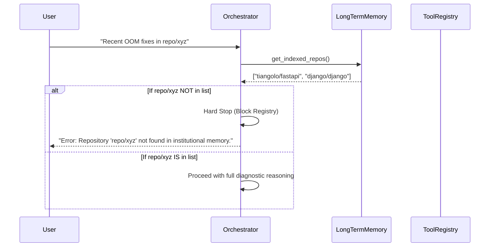
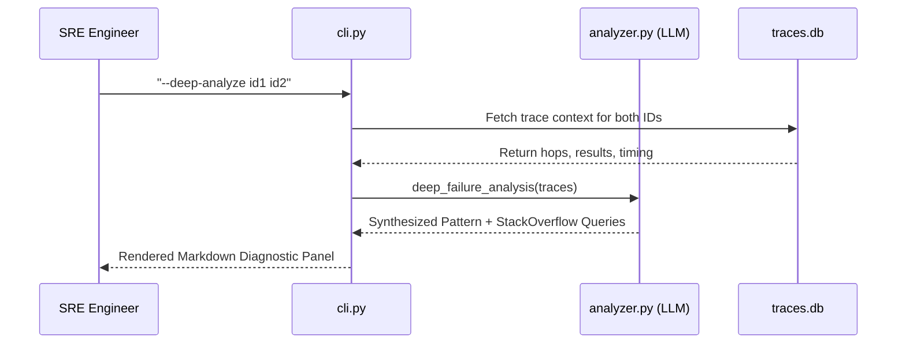

# DevOps Agent Architecture — Deep Dive

The **DevOps Agent** is the operational core of the system. It handles high-level reasoning, interacts with the semantic knowledge base, and executes tools against the external world (GitHub, Web). 

## Architecture System Structure

The agent is organized into modular layers, separating the user interface from the reasoning brain and the tooling hands.

```mermaid
graph TD
    subgraph "🤖 DevOps Agent (`devops_agent/`)"
        direction TB
        
        MAIN["main.py<br/>(System Entry)"]
        CLI["cli.py<br/>(Interactive REPL + Diagnostics)"]
        
        subgraph "Core Intelligence"
            ORCH["orchestrator.py<br/>(Repo-Aware Triage)"]
            LLM["llm_client.py<br/>(Groq / OpenAI API)"]
            
            ORCH <--> LLM
        end
        
        subgraph "Memory Layer"
            STM["short_term.py<br/>(Conversation Buffer)"]
            LTM["long_term.py<br/>(Scoped SQLite Store)"]
            
            ORCH --> STM
            ORCH --> LTM
        end
        
        subgraph "Tooling Layer"
            REG["registry.py<br/>(Tool Schema & Dispatcher)"]
            GH["github_tools.py<br/>(REST API Client)"]
            WEB["web_tools.py<br/>(Search Integration)"]
            
            ORCH --> REG
            REG --> GH
            REG --> WEB
        end
        
        MAIN --> CLI
        CLI --> ORCH
    end
```

## 🔄 Interaction Workflows

### 1. The Knowledge Boundary Workflow
The agent now performs a strict scope check before entering expensive tool loops.

### 2. Deep Diagnostic Workflow
Engineers can trigger multi-run analysis directly from the CLI.

### 3. The 6-Step Self-Healing Loop
The agent follows a standardized protocol to detect, diagnose, and resolve issues automatically.

| Step | MCP Tool | Responsibility |
|---|---|---|
| **1. Find** | `get_failure_candidates` | Identify failed runs with `outcome=n`. |
| **2. Diagnose** | `compare_runs` | Determine root cause (e.g., Knowledge Gap). |
| **3. Propose** | `propose_fix` | Generate a non-LLM fix action. |
| **4. Approve** | **Human Gate** | Wait for explicit approval before acting. |
| **5. Apply** | Tool Execution | Run indexing or configuration fixes. |
| **6. Verify** | `verify_fix` | Confirm resolution and log findings. |

## 📄 Component Definitions

| Module | Responsibility |
|---|---|
| **`orchestrator.py`** | The "Brain." Implements the decision tree for Triage, Routing, and **Knowledge Scoping**. |
| **`llm_client.py`** | The "Vocal Cords." Standardizes communication with high-performance LLMs. |
| **`long_term.py`** | The "Archive." Manages the vector-based SQLite database and tracks **Indexed Repositories**. |
| **`registry.py`** | The "Hands." Dynamically generates schemas for LLM tool-calling and dispatches execution. |
| **`cli.py`** | The "Face." A sophisticated terminal interface with support for **Deep Diagnostics**, **REPL command parsing**, and the **6-step Self-Healing 'heal' command**. |

---
[← Back to README](../README.md)
