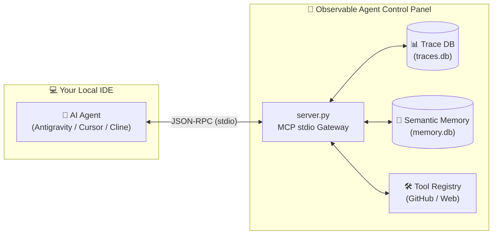

# IDE Integration Guide (MCP Protocol)

Integrating the **Observable Agent Control Panel** into your AI-powered IDE (Cursor, Cline, Antigravity) allows you to bridge the gap between high-level reasoning and granular execution observability.

## 📡 The Connection Workflow

Your IDE communicates via the **Model Context Protocol (MCP)** to execute tools and read diagnostics from the Control Panel backend.



---

## 1. Antigravity Configuration

Antigravity uses a centralized `mcp_config.json` located at:
`C:\Users\PaarthGala\.gemini\antigravity\mcp_config.json`

**Configuration Payload**:
```json
{
  "mcpServers": {
    "observable-agent-control-panel": {
      "command": "C:/Users/PaarthGala/Coding/observable-agent-control-panel/.venv/Scripts/python.exe",
      "args": [
        "C:/Users/PaarthGala/Coding/observable-agent-control-panel/devops_agent/main.py",
        "--mode",
        "server"
      ],
      "env": {
        "PYTHONPATH": "C:/Users/PaarthGala/Coding/observable-agent-control-panel"
      }
    }
  }
}
```

---

## 2. Cursor IDE

1.  Open **Settings** (gear icon ⚙️) -> **Features** -> **MCP Servers**.
2.  Click **"+ Add New MCP Server"**.
3.  **Name**: `observable-agent-control-panel`
4.  **Type**: `command`
5.  **Command**: `C:\Users\PaarthGala\Coding\observable-agent-control-panel\.venv\Scripts\python.exe`
6.  **Args**: `C:\Users\PaarthGala\Coding\observable-agent-control-panel\devops_agent\main.py --mode server`

---

## 3. Cline / RooCode (VS Code)

Add this entry to your `cline_mcp_settings.json`:

```json
{
  "mcpServers": {
    "observable-agent-control-panel": {
      "command": "C:\\Users\\PaarthGala\\Coding\\observable-agent-control-panel\\.venv\\Scripts\\python.exe",
      "args": ["C:\\Users\\PaarthGala\\Coding\\observable-agent-control-panel\\devops_agent\\main.py", "--mode", "server"],
      "env": {
        "PYTHONPATH": "C:\\Users\\PaarthGala\\Coding\\observable-agent-control-panel"
      }
    }
  }
}
```

---

## 💡 Why Integrate via MCP?

*   **Native Tooling**: Your IDE agent gains access to **16 specialized tools**, including `search_memory` and `index_repo_prs`, directly from the chat window.
*   **Persistent Observability**: Every tool call made by the IDE is logged into your local `traces.db`.
*   **Self-Healing**: If the IDE agent fails, you can trigger the **6-step Self-Healing Loop** using tools like `get_failure_candidates` and `verify_fix` to automatically diagnose and repair knowledge gaps.

---
[← Back to README](../README.md)
