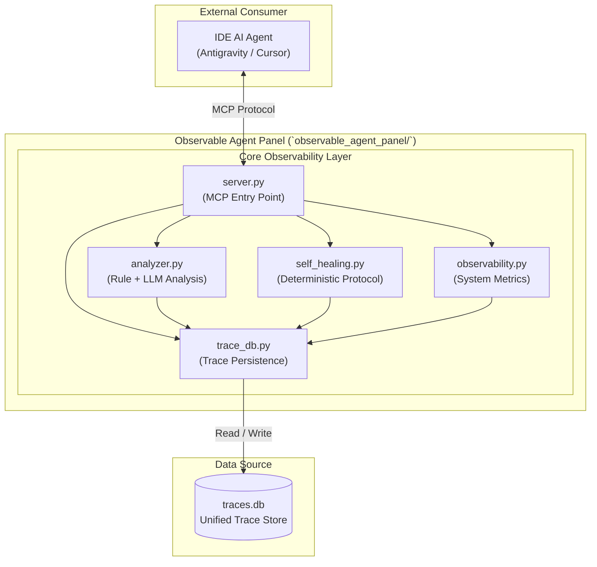
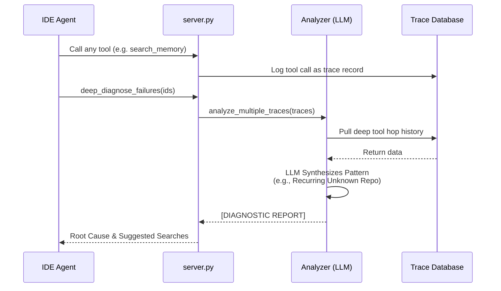

# Observable Agent Panel Architecture — Deep Dive

The **Observable Agent Control Panel** is the diagnostic and monitoring layer of the system. It sits independently from the DevOps Agent, observing its SQLite trace logs and providing a combination of rule-based and LLM-powered analysis.

## Architecture System Structure

The panel acts as a visibility gateway, ensuring that every action taken by the executing agent or the IDE agent itself is recorded and searchable.

## 🔄 Diagnostic Workflow (Deep Healing)

The panel now supports **Deep Failure Diagnosis**, which uses a Senior SRE reasoning model to synthesize multiple failures.

| Module | Responsibility |
|---|---|
| **`server.py`** | The "Gateway." Exposes **16 diagnostic tools** via MCP. Now includes **Automatic Tracing** for all tool calls. |
| **`analyzer.py`** | The "Diagnostician." Contains rule-based heuristics and **LLM-powered Deep Diagnostics** for failure analysis. |
| **`self_healing.py`** | The "Mechanic." Implements the deterministic **6-step Self-Healing Protocol** (Find -> Diagnose -> Propose -> Verify). |
| **`trace_db.py`** | The "Record Keeper." Manages persistent execution traces. Now tracks **MCP tool hits** as individual runs. |
| **`observability.py`** | The "Monitor." Aggregates system health, success rates, and active anomaly alerts. |

## 🛠️ Key Capabilities
*   **Unified Visibility**: Every tool call made by the IDE is now a first-class citizen in the trace database.
*   **6-Step Self-Healing**: Automated detection and repair of knowledge gaps via both MCP and Interactive CLI.
*   **Deep Failure Analysis**: LLM-powered diagnostics identify why an agent is stuck in loops (e.g., hitting the tool execution ceiling on unindexed repos).
*   **Contextual Suggestions**: Generates specific StackOverflow/StackExchange queries to help engineers find external solutions to recurring failures.

---
[← Back to README](../README.md)
