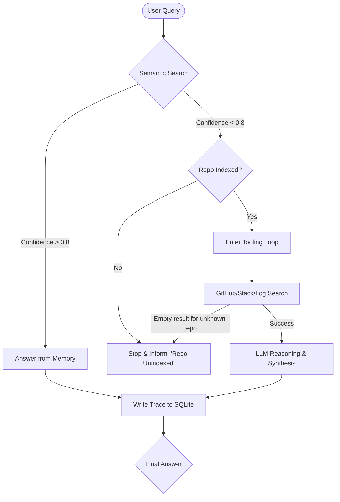
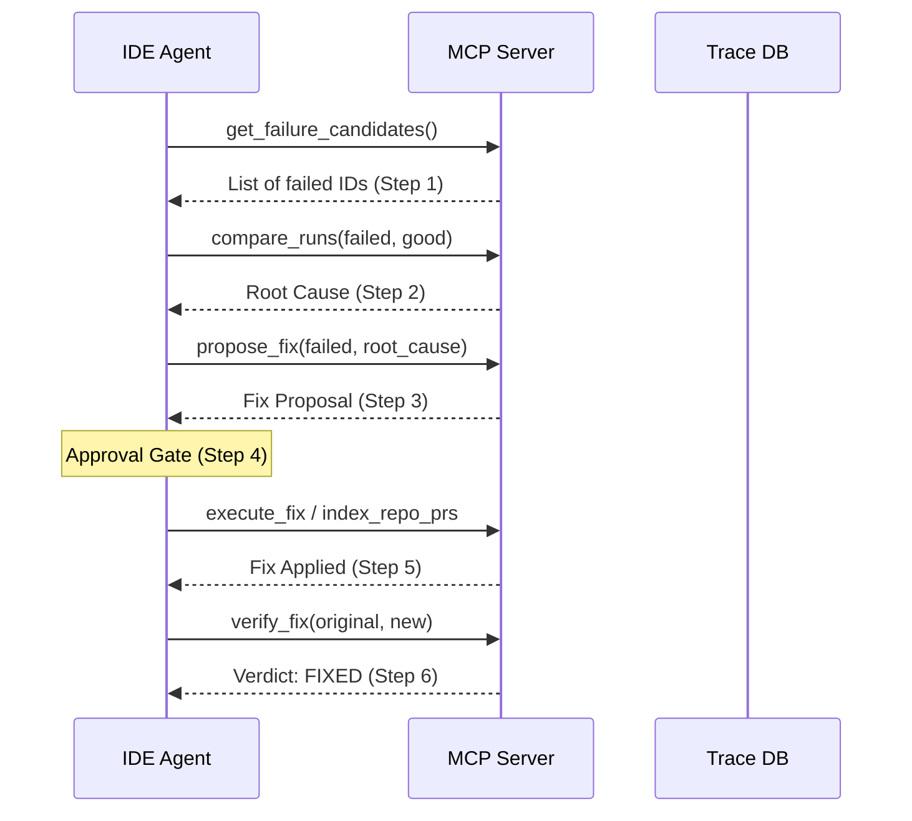

# System Workflow & Logic — Observable Agent Control Panel

This document details the end-to-end operational workflow of the system, from initial user query to automated self-healing and deep failure diagnosis.

## 1. High-Level Component Map

The project is architecturally split into two halves: the **Executing Agent** (Monitored) and the **Control Panel** (Monitor).

```mermaid
graph TB
    subgraph "👤 Engineer / IDE Agent"
        Q["User Query / Audit Request"]
    end

    subgraph "🔍 Observable Agent Panel (The Monitor)"
        direction TB
        SRV["server.py<br/>MCP Entry Point"]
        ANA["analyzer.py<br/>Deep Diagnostic Engine"]
        TDB["trace_db.py<br/>SQLite Trace Store"]
    end

    subgraph "🤖 DevOps Agent 
                (The Monitored System)"
        direction TB
        ORCH["orchestrator.py<br/>Repo-Aware Reasoning"]
        LTM["long_term.py<br/>Scoped Semantic Memory"]
        REG["registry.py<br/>Tool Dispatcher"]
    end

    subgraph "💾 Persistence"
        DB1[(memory.db<br/>Facts & Embeddings)]
        DB2[(traces.db<br/>Audit/Run Logs)]
    end

    Q -->|"MCP tool call (Traced)"| SRV
    SRV -->|"deep_diagnose_failures"| ANA
    SRV -->|"get_recent_traces / search_traces"| TDB
    SRV -->|"search_memory"| LTM
    SRV -->|"execute_tool"| REG
    ORCH -->|"Decision Logging"| TDB
    LTM --> DB1
    TDB --> DB2
    ANA -->|"LLM Analysis"| Q
```

## 2. The Decision Workflow (Knowledge Boundary)

The `Orchestrator` uses a "Token-Optimized" decision tree with strict knowledge scoping to prevent hallucinations and infinite loops.

## 3. Strict Tool Usage Policy (The MCP Boundary)

To ensure reliability and prevent hallucinations, the agent operates under a **Strict MCP-Only Policy**:

1.  **Registry Enforcement**: The agent is programmatically and prompt-constrained to ONLY use tools listed in `devops_agent/tools/registry.py`.
2.  **No General Knowledge**: The agent is instructed to avoid using its internal general knowledge for technical resolutions. If a solution is not found in the indexed memory or current tool results, it must admit the gap.
3.  **No Unofficial Web Search**: Generic web search tools outside of the official `search_stackexchange` MCP tool are forbidden. This ensures that every fact cited by the agent can be traced back to a verifiable engineering source (GitHub or StackOverflow).
4.  **Error Protocol**: If an MCP tool returns an error or empty result, the agent must report the failure rather than attempting to guess a solution or fall back to external search.

## 4. The Self-Healing Workflow (Deep Analysis)

When multiple runs fail or performance degrades, the system triggers an LLM-powered deep dive:

| Step | MCP Tool | What Happens |
|---|---|---|
| 1. Find failures | `get_failure_candidates` | Locates runs with `outcome=n` or tool errors |
| 2. Diagnose | `compare_runs` + `get_trace_detail` | Root cause: KNOWLEDGE GAP, TOOL FAILURE, ROUTING SHIFT |
| 3. Propose | `propose_fix` | Rule-based fix proposal, no LLM needed |
| 4. Approve | Human confirms | Gate — no action without explicit approval |
| 5. Apply | `index_repo_prs` / tool retry | Fix executed |
| 6. Verify | `verify_fix` | Returns `FIXED` or `NOT_FIXED`, max 3 attempts |

## 4. Operational Modes & Advanced Commands

| Mode | Command | Best For |
|---|---|---|
| **CLI (REPL)** | `python -m devops_agent.main --mode cli` | Interactive use, debugging, and real-time observability. |
| **Server (MCP)** | `python -m devops_agent.main --mode server` | Cursor/Antigravity integration with automatic trace logging. |

### Diagnostic Commands (REPL & Shell)
- **`--traces [N]`**: List the last N run IDs and their outcomes.
- **`--search-logs <query>`**: (New) Search historical traces for error patterns or keywords.
- **`--explain <ID>`**: Render the agent's internal reasoning as Markdown.
- **`--compare <ID1> <ID2>`**: Side-by-side structural comparison of two runs.
- **`--deep-analyze <IDs>`**: LLM-powered pattern analysis across multiple failures.
- **`heal`**: (Interactive Only) Trigger the automated 6-step self-healing loop.

## 5. Visibility & Persistence

*   **MCP Tracing**: Every tool call made by the IDE (e.g., `search_memory`) is now automatically recorded as a trace.
*   **`data/memory.db`**: Stores vector-based semantic facts (PRs, Issues).
*   **`data/traces.db`**: Stores every step taken by the agent for later auditing.
*   **`.env`**: Holds `GROQ_API_KEY`, `GITHUB_TOKEN`, and `HF_TOKEN`.

---
[← Back to README](../README.md)
